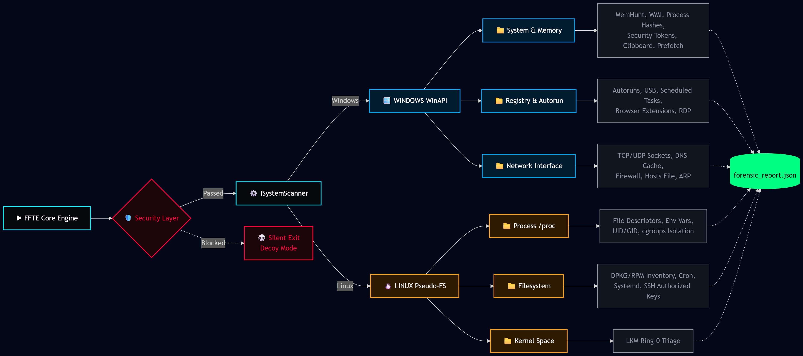

# 🛡️ Fast Forensic Triage Extractor (FFTE)

> A high-performance, cross-platform (Windows WinAPI / Linux Pseudo-FS) forensic live response triage collection tool. Implemented in pure C++20 with an automated, self-registering plugin architecture and built-in anti-reverse engineering protections.

***

## ❓ What is it and why is it needed?

**FFTE** is a high-performance **Digital Forensics Live Response** tool designed for the rapid collection of digital artifacts from compromised or suspicious systems — without requiring system downtime or the installation of third-party software.

In cybersecurity incident response, **time is the most valuable resource**. If an attacker or malware is present in a system, they can wipe forensic traces (logs, history, cache) at any moment.

FFTE allows forensic investigators and system administrators to execute a single, standalone `.exe` file that instantly captures a **"snapshot"** of the system's state — including volatile memory, network connections, active processes, and persistence mechanisms — saving the results into a structured **JSON report** for immediate analysis.

***

## 🚀 Architecture Overview



* **Zero-Dependency Core:** Statically linked C++ runtime (`-static`). Only relies on native OS APIs (`<windows.h>`, `<iphlpapi.h>`, WMI COM) and Pseudo-FS (`/proc`), allowing execution directly from a USB drive on infected machines without any pre-installed libraries.
* **Autopilot Plugin System:** Modules self-register into the RAM at runtime before `main()` executes via static initialization vectors.
* **Stealth & Evasion:** Includes Anti-Debugging Honeypot mechanics to feed fake Decoy data to debuggers (IDA Pro / x64dbg) or silently terminate.
* **Const-Correctness & RAII:** Strictly follows modern C++20 resource management principles to prevent memory leaks during forensic data extraction.

---

## 🎓 Academic Integrity & Contribution Matrix

*Note for Reviewers: This table demonstrates full transparency regarding the development process. Original function numbers are preserved to match Git commit logs exactly.*
* **Idea:** Who architected the forensic logic.
* **Status / Coder:** Who wrote the actual C++ implementation.
* 🔥 = *Advanced execution evasion/kernel structures.*
* 📖 = *Based on "Windows Forensics Analyst Field Guide 2023" methodology.*

### 🏆 Top 5 Advanced DFIR & Academic Research Capabilities

| # | Forensic Module | Technical Implementation & Data Extracted | Idea Source | Status |
|:---:|:---|:---|:---:|:---:|
| **56** | **WMI Hardware Telemetry** | Interacts with complex Windows COM interfaces (`wbemuuid`) to extract raw SMBIOS motherboard serials and CPU/GPU data. | Me | ✅ |
| **52** | **Event Logs Security** 📖 | Uses `EvtQuery` API to parse low-level XML payloads detecting Brute-Force attacks (Event ID 4625). | Book | ✅ |
| **29** | **Authenticode Verification** 🔥| Calls `WinVerifyTrust` kernel API to detect unsigned `.sys` Rootkits injected into the OS. | AI | ✅ |
| **41** | **Linux Kernel Modules** 🔥| Parses Ring-0 `/proc/modules` to detect hidden Linux Kernel Modules (LKM). | AI | ✅ |
| **51** | **Prefetch Execution Triage** 📖| Deep filesystem parsing of restricted `.pf` execution artifacts to extract precise historical timestamps. | Book | ✅ |

---

### 🕵️‍♂️ Digital Footprint & Triage (Core System)

| # | Capability | Data Extracted / Method | Idea | Status |
|:---:|:---|:---|:---:|:---:|
| **01** | `scanUSBHistory()` | `USBSTOR` registry keys for plugged physical devices | Me | ✅ |
| **02** | `scanBluetoothHistory()`| `BTHPORT` device MAC addresses and names | Me | ✅ |
| **03** | `scanBrowserHistory()` | Parses `places.sqlite` / `History` DBs for web footprints | Me | ✅ |
| **04** | `checkAnonymity()` | Detects active VPN (Nord/Tailscale) and Proxy software | Me | ✅ |
| **05** | `getWifiLocation()` | Triangulates GPS coordinates via BSSID endpoints | Me | ✅ |
| **06** | `getFocusTime()` | Translates 64-bit Windows FILETIME into active screen-time| Me | ✅ |
| **07** | `scanServices()` | Enumerate Windows SCM for persistence/drivers | Me | ✅ |
| **08** | `scanFirewallRules()` | Dump of active allowed/blocked ports | AI | ✅ |
| **09** | `getArpTable()` | Queries `GetIpNetTable` for routing spoofing | Me | ✅ |
| **10** | `scanOSEnvironment()`| Boot time, Install Date, and Environment variables | Me | ✅ |

### 🖥️ Windows — Processes & Memory (`src/windows/artifacts/system/`)

| # | Capability | Data Extracted / Method | Idea | Status / Coder |
|:---:|:---|:---|:---:|:---:|
| **11** | `getProcessHash()` | SHA256 hashing of active memory executables | AI | ✅ AI + Me |
| **12** | `scanProcessThreads()` | Thread entry base addresses | Me | ⏳ Planned (Deep Forensics) |
| **13** | `getProcessEnvironment()` | Process memory environment blocks | Me | ✅ Me |
| **14** | `getProcessStartTime()` | Absolute UTC launch timestamps | Me | ✅ AI + Me |
| **15** | `scanProcessHandles()` | Locked files, mutexes, and registry keys | Me | ⏳ Planned (Deep Forensics) |
| **16** | `getProcessIntegrity()` | Security tokens (Low/Medium/High/System) | Me | ✅ Me |
| **NEW** | `scanClipboard()` | Extracts live clipboard RAM buffers for data exfiltration analysis | Me | ✅ AI + Me |
| **NEW** | **MemHunt (RWX Scanner)** 🔥| Scans active process memory to find injected Shellcode / Cobalt Strike | AI | ✅ AI + Me |

### 🖥️ Windows — Registry & Autorun (`src/windows/artifacts/registry/`)

| # | Capability | Data Extracted / Method | Idea | Status / Coder |
|:---:|:---|:---|:---:|:---:|
| **17** | `scanHKLM_Run()` | Global auto-start executables | Me | ✅ Me |
| **18** | `scanHKCU_Run()` | User-specific auto-start executables | Me | ✅ Me |
| **19** | `scanStartupFolder()` | LNK files in Startup directories | Me | ✅ AI + Me |
| **20** | `scanScheduledTasks()` | `TaskCache\Tree` registry extraction | Me | ✅ AI + Me |
| **21** | `scanBootExecute()` | Session Manager boot-time execution | Me | ✅ Me |
| **22** | `scanWinlogonNotify()` | Logon notification stealth DLLs | AI | ✅ AI + Me |
| **23** | `scanBrowserExtensions()`| Malicious registry browser hooks | Me | ✅ AI + Me |

### 🖥️ Windows — System & Drivers (`src/windows/artifacts/system/`)

| # | Capability | Data Extracted / Method | Idea | Status / Coder |
|:---:|:---|:---|:---:|:---:|
| **24** | `scanFailedDriverLoads()` | EventLog traces of failed rootkit injection | AI | ✅ Covered by #52 |
| **25** | `getWindowsInstallDate()` | Epoch timestamp of OS installation | Me | ✅ Me |
| **26** | `getWindowsLastShutdown()`| Dirty/Clean shutdown logs | Me | ✅ Covered by #52 |
| **27** | `scanPagefileUsage()` | Size and path of `pagefile.sys` RAM dump | AI | ✅ AI + Me |
| **28** | `scanHibernationFile()` | Size and path of `hiberfil.sys` | AI | ✅ AI + Me |
| **29** | **Authenticode Verify** 🔥| Calls `WinVerifyTrust` to detect unsigned `.sys` Rootkits | AI | ✅ AI + Me |
| **30** | `scanSwapFileUsage()` | Size and path of `swapfile.sys` | AI | ✅ AI + Me |

### 🌐 Windows — Network Interface (`src/windows/artifacts/network/`)

| # | Capability | Data Extracted / Method | Idea | Status / Coder |
|:---:|:---|:---|:---:|:---:|
| **31** | `getTCPConnections()` | IPv4/IPv6 Active bound sockets | Me | ✅ AI + Me |
| **32** | `getUDPConnections()` | UDP listening ports | Me | ✅ Me |
| **33** | `scanDNSCache()` | Local DNS resolution history | Me | ✅ AI + Me |
| **34** | `getNetworkAdapters()` | Hardware MACs and active DHCP | Me | ✅ Me |
| **35** | `scanFirewallRules()` | Dump of active allowed/blocked ports | AI | ✅ AI + Me |
| **36** | `getProxySettings()` | WinINET default gateway overrides | Me | ✅ Me |
| **37** | `scanHostsFile()` | Contents of `etc/hosts` DNS hijacking | Me | ✅ AI + Me |

### 🐧 Linux — Processes & Memory (`src/linux/artifacts/process/`)

| # | Capability | Data Extracted / Method | Idea | Status / Coder |
|:---:|:---|:---|:---:|:---:|
| **41** | **LKM Triage** 🔥 | `/proc/modules` load base and sizes | AI | ✅ AI + Me |
| **42** | `getProcessOpenFiles()` | Symlinks from `/proc/[pid]/fd` | AI | ✅ AI + Me |
| **43** | `getProcessEnvironment()`| Null-byte separated `/proc/[pid]/environ` | AI | ✅ AI + Me |
| **44** | `getProcessCredentials()`| Real/Effective UID & GID from `status` | AI | ✅ AI + Me |
| **45** | **Container Isolation** 🔥| Isolation paths (Docker/Kubernetes/LXC) via `cgroups` | AI | ✅ AI + Me |

### 🐧 Linux — Filesystem & Packages (`src/linux/artifacts/filesystem/`)

| # | Capability | Data Extracted / Method | Idea | Status / Coder |
|:---:|:---|:---|:---:|:---:|
| **46** | `scanInstalledPackages()`| DPKG/RPM software inventory lists | Me | ✅ AI + Me |
| **47** | `scanScheduledTasks()` | Contents of `/etc/crontab` | Me | ✅ AI + Me |
| **48** | `scanSystemdUnits()` | Enabled `systemctl` services | AI | ✅ AI + Me |
| **49** | `scanMountPoints()` | `/proc/mounts` remote/local drives | Me | ✅ Me |
| **50** | `scanSSHKeys()` | `~/.ssh/authorized_keys` persistence | Me | ✅ AI + Me |

### 📖 Advanced DFIR Research (Based on "Windows Forensics Analyst Field Guide 2023" & WMI)

| # | Capability | Data Extracted / Method (Target Directory) | Idea | Status / Coder |
|:---:|:---|:---|:---:|:---:|
| **51** | `scanPrefetchFiles()` | `.pf` files execution evidence (`src/windows/artifacts/system/`) | Book/Me| ✅ AI + Me |
| **52** | `scanEventLogs()` | Security IDs 4625 via `EvtQuery` (`src/windows/artifacts/system/`) | Book/Me| ✅ AI + Me |
| **53** | `scanAmcache()` | `AppCompatCache` execution history (`src/windows/artifacts/registry/`)| Book/Me| ⏳ Planned (Deep Forensics) |
| **54** | `scanRDPSessions()` | `Terminal Server Client` tracking (`src/windows/artifacts/registry/`) | Book/Me| ✅ AI + Me |
| **55** | `scanSRUMDatabase()` | `SRUDB.dat` hidden metrics (`src/windows/artifacts/network/`) | Book/Me| ⏳ Planned (Deep Forensics) |
| **56** | `scanHardwareWMI()` | Motherboard Serial, CPU, GPU, RAM (`src/windows/artifacts/system/`) | Me | ✅ AI + Me |

***

## 📊 How to use the Web Dashboard (FFTE Viewer)

After generating the `forensic_report.json` using the FFTE executable, follow these steps to visualize the data:

1. **Locate the file:** Ensure `viewer.html` and `forensic_report.json` are in the same directory (or just have the JSON file ready).
2. **Open the Dashboard:** Open `viewer.html` in any modern web browser (Chrome, Brave, Edge).
3. **Upload Report:** Click the **"Load JSON Report"** button in the dashboard and select your `forensic_report.json` file.
4. **Analyze:** The dashboard will instantly parse the data locally in your browser memory (RAM), providing an interactive view with:
   - **Interactive Tables:** Sorting, global search, and filtering (e.g., filter memory anomalies by `RWX` status).
   - **Architecture Map:** Visual flow of the FFTE execution process.
   - **Data Exfiltration:** View clipboard contents and network resolution (DNS Cache).
   - **Export:** Save your analysis to CSV for further deep-dive investigations.

***

## 🛠️ Build Instructions

This project uses CMake and requires a compiler with C++20 support (MSVC `/std:c++20` or GCC `-std=c++20`).

**Windows (MinGW/GCC or MSVC):**

```bash
mkdir build && cd build
cmake ..
cmake --build . --config Release
```

---

**Linux (WSL / Debian):**

```bash
mkdir build_linux && cd build_linux
cmake ..
cmake --build .
```

---

## ▶️ Usage

### 🪟 Windows

After building, run the executable directly — **no installation required**.

```bash
# From the build directory:
.\fastforensics.exe

# Or specify a custom output path:
.\fastforensics.exe --output C:\forensics\report.json
```

> **Tip:** Run as **Administrator** to enable full artifact collection (registry, event logs, process handles, memory scanning).

```powershell
# Run elevated via PowerShell:
Start-Process -FilePath ".\fastforensics.exe" -Verb RunAs
```

The report will be saved as `forensic_report.json` in the current directory.

---

### 🐧 Linux

```bash
# Make executable (first time only):
chmod +x ./fastforensics

# Run as root for full artifact access (/proc, kernel modules, cgroups):
sudo ./fastforensics

# Or specify a custom output path:
sudo ./fastforensics --output /tmp/forensic_report.json
```

> **Note:** Root privileges are required for `/proc/[pid]/mem`, LKM triage, and container isolation detection.

The report will be saved as `forensic_report.json` in the current directory.

---

### 📁 Output

Both platforms produce a unified structured report:

```
forensic_report.json   ← structured artifact snapshot
```

Open `viewer.html` in any modern browser and load the JSON file to visualize results interactively.